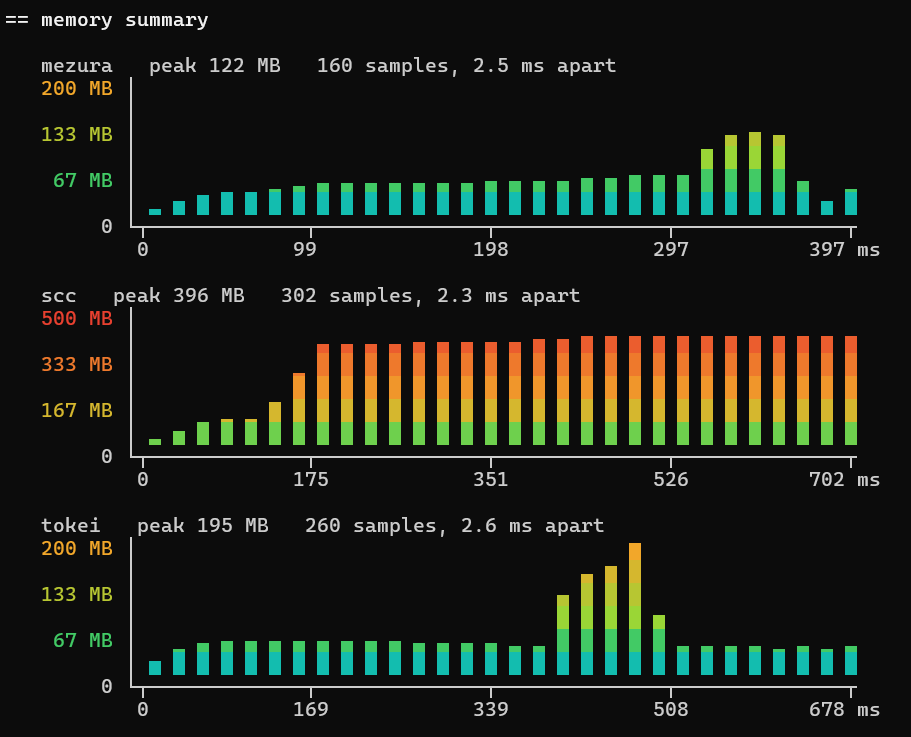

# linebench

[](https://github.com/loc-conformance/linebench/actions/workflows/ci.yml)
[](#licence)

A benchmark harness for line counters. It measures every counter on the same tree, on equal
work, and puts beside every number what the machine was doing while it was measured: the
background load, the power scheme, the antivirus state, whether the corpus was on the pinned
commit, and a control run at both ends of the run that says whether the machine moved in
between. The counters it measures are data, one `counters/<name>.toml` each, and it never
builds a counter: it fetches the release, hashes it, and writes the hash into the record.

Today it knows cloc, mezura, scc and tokei. Adding one is a definition file.

## Prerequisites

git, [hyperfine](https://github.com/sharkdp/hyperfine), curl or wget, and tar on PATH; every
system but a bare Windows ships the last two, and Windows 10 and 11 have both. cargo only for a
counter that publishes no binaries and has to be built (tokei), and perl for one that ships as
a script (cloc on Linux and macOS).

| system | command |
|---|---|
| Debian, Ubuntu | `sudo apt install hyperfine` |
| Fedora, RHEL | `sudo dnf install hyperfine` |
| Arch | `sudo pacman -S hyperfine` |
| openSUSE | `sudo zypper install hyperfine` |
| Alpine | `apk add hyperfine` |
| Windows | `winget install sharkdp.hyperfine` |
| macOS | `brew install hyperfine` |
| anywhere else | `cargo install hyperfine` |

## Running it

linebench keeps its own directory on every machine, made on first use: `%APPDATA%\linebench`
on Windows, `~/Library/Application Support/linebench` on macOS, `~/.local/share/linebench` on
Linux. The counter binaries go there by default, under `counters/`, and so does
`linebench.conf`, copied from `linebench.conf.example`; a `linebench.conf` in the directory you
run from wins over it. The conf says where the corpus checkouts live on this machine:

```toml
[corpora]
linux = "D:/corpora/linux"
```

First time on a machine:

```
linebench setup
```

`setup` fetches every counter at the version its definition declares, into the counters
directory, and the corpus at the commit its definition pins. What it fetched, and its sha256,
goes into `linebench-fetched.toml` beside the binaries. A second `setup` answers "already
here" for what matches and fetches again what does not. It runs from an ordinary terminal and
refuses an elevated one, so that the files it writes belong to you; only `run` is elevated.
Where there is no ordinary user, as on a CI runner, `--allow-elevated` lifts that refusal.
`setup` asks the GitHub API which files a release has, and anonymous calls are limited per
address, a limit that shared CI runners hit. A token in `GITHUB_TOKEN` or `GH_TOKEN` lifts it;
the token goes to that one call and never to a download. The workflow sets the token Actions
provides.

`setup --newest` fetches the newest release of each counter in place of the version its
definition pins, for every counter or for those named by `--counters`, and records that pin
in the manifest beside the binary. From then on that version is the one in effect for every
command on this machine, until the definition itself catches up with it or passes it, when
every command says the pin is set aside; `check` says which counter is pinned this way. A
definition that comes from `--add` is left alone, with a line. A plain `setup` keeps the pin.
To go back, remove the counter's entry from `linebench-fetched.toml` and run `setup` again.

Then, on Linux and macOS:

```
sudo linebench run
```

On Windows the same, from a terminal opened with "Run as administrator":

```
linebench run
```

Elevated, it sets the cpu governor to `performance` (Linux) or the power scheme to High
performance (Windows) and puts it back when the run ends, whether it finishes, fails or is
interrupted with Ctrl-C. Before it changes anything it prints the command that puts it back by
hand, which is what a run that is killed outright leaves you with. Unelevated it prints what it
would have changed and asks before doing any work. `--yes` answers that question, `--no-prep`
skips the whole thing even when elevated, and with no terminal attached it carries on.

The commands are `setup`, `check`, `noise`, `run` and `report`. `linebench help` lists every
flag.

## Where things are

A flag beats an environment variable, which beats `linebench.conf`.

| what | flag | environment | in the conf | default |
|---|---|---|---|---|
| the tree that gets counted | `--corpus-path <dir>` | | `[corpora]` entry | the `[corpora]` entry of the corpus |
| what to count in it, with no corpus definition | `--extensions rs,c` | | | |
| which corpus definition | `--corpus <name>` | `LINEBENCH_CORPUS` | | the only `[corpora]` entry, when there is one |
| the counter binaries | `--counters-dir <dir>` | `LINEBENCH_COUNTERS` | `counters = "<dir>"` | `counters/` in linebench's own directory |
| where results go | `--out <dir>` | `LINEBENCH_OUT` | `out = "<dir>"` | `results/` in the current directory |
| definitions of your own | `--add <path>`, repeatable | | `add = ["<path>", ...]` | none |
| the control | `--control <instance>` | | `control = "<instance>"` | the first instance named |
| counters left out on this machine | | | `skip = ["cloc"]` | none |
| a GitHub API token for `setup` | | `GITHUB_TOKEN`, else `GH_TOKEN` | | none |

The tree is the checkout of a corpus definition (the kernel as `linux`, this repository as
`linebench`, or one you added), or any directory at all together with `--extensions`, which
names the file extensions every counter is pointed at so that all of them do the same work.
Such a run is recorded as unpinned, named after the directory, and the counters' counts are
compared with each other; the flag is refused beside `--corpus`, since a definition says its
own extensions.

The counters directory is where `setup` puts what it fetches, with the manifest of hashes,
and of any `--newest` pin, beside the binaries and the copies of your own builds under
`given/`; the setting is only for
keeping them elsewhere, say under a Defender exclusion path. Results go one
`results/<corpus>/<system>/<stamp>/` per run, with `results/README.md` as the page over all of
them. `--add` takes a counter or a corpus `.toml`, or a directory of them, read beside the
built-in ones; one named like a built-in definition takes its place, and a line says so. The
control is the instance timed alone at both ends of the run, whose shift is read as the
machine's own movement. `skip` leaves counters out of every default set on this machine,
whatever the corpus: `setup` does not fetch them, `check` and `run` leave them out and say so,
and naming one in `--counters` runs it. The token lifts the anonymous rate limit on the release
lookup and goes to that one call only.

With nothing set at all, every command but `report` refuses and prints the recipe. Keep the
corpus and the counters on a local disk: measuring across `/mnt` from WSL, or over a network
share, measures the mount.

The counters directory belongs to `setup`. A binary in it whose hash is not the one setup
wrote is refused, with the two ways out: run setup again, or measure your own build as an
instance, below.

## What a run measures

An instance is a definition, a binary and a name in the table. By default every counter
definition is one instance, named after itself, with the binary setup fetched, and so is every
`[given]` entry in `linebench.conf`. `--counters` picks a subset and fixes the order:

```
linebench run --counters mezura,scc,tokei
```

The control is the instance timed alone at the start and at the end of the run, and the
workload `noise` times. `control = "mezura"` in `linebench.conf` names it for every run on
the machine, `--control` for one run, and with neither it is the first instance named, which
with no `--counters` is the first definition alphabetically, today cloc, the slowest of the
four. A run that does not hold the conf's control says so and times its first instance as the
control; a `--control` that is not in the run is refused. Keep the control the same across the
runs you want compared: "since the last run" reads every change against the control's own
shift, and that shift is only known when an earlier run timed the same control build. After
the control's version changes, the block says so until a later run shares the new build.

A build of your own is an instance too, named `<counter>@<tag>`, or by the counter's plain
name when its definition has no `[acquisition]`, so no release stands beside it:

```
linebench run --counters mezura,mezura@dev --given mezura@dev=D:\dev\mezura\target\release\mezura.exe
```

The given binary is copied under `given/<instance>/` in the counters directory before anything
reads it, fresh on every run, because the file cargo built measures slower than a plain copy
of itself and because the same name in the same directory is what gets the same antivirus
treatment. The copy is hashed and asked its version, and the record says `given` with the tag
as its label. The instance runs under the counter's definition, or under its own when the
flags of your build differ from the release's:

```
linebench run --counters mezura,mezura@dev --given mezura@dev=<path> --definition mezura@dev=D:\dev\mezura\.linebench\mezura.toml
```

Both fit in `linebench.conf`, so the dev loop is one word:

```toml
[given."mezura@dev"]
binary     = "D:/dev/mezura/target/release/mezura.exe"
definition = "D:/dev/mezura/.linebench/mezura.toml"
```

An instance can carry arguments of its own: `args = ["--threads", "4", "16"]` in its `[given]`
entry, or `--args mezura@c16="--threads 4 16"` for one run, split on whitespace. They go right
after the target, before the languages and the same-work flags, in every invocation of that
instance, both tables included. With no binary of its own the instance runs the release
binary, so `[given."mezura@c16"]` holding only `args` measures the release with those
arguments beside the release as it is. Arguments make an instance of their own, so the name
carries a tag, and a changed `args` sets a run aside in "since the last run" the way changed
same-work flags do.

`--expect-identical mezura=mezura@dev` (pairs, comma separated) checks that two instances of
one counter printed the same JSON, in both tables, before any timing starts. The fields the
counter's definition lists as `volatile` (a timestamp, its version, its own timing) are set
aside, lists of objects are compared regardless of their order, and the first difference is
named with both values. The verdict is printed, kept in the record and shown on the page, and
a run where the two differ exits 1 once everything is written: the times still stand, the
claim that the work was the same does not.

The tag is a column name. The bytes are identified afresh on every run by the hash and the
version line in the record, so a stale entry cannot describe the wrong binary. A run holding
any given instance is written under `results/local/`, which is gitignored, and the results page
lists such runs in their own table under the release runs. An entry in the conf joins every run
that names no `--counters`, so for a run meant for the release tables comment it out or name
the release instances with `--counters`.

## check

```
linebench check
```

Answers "is this machine ready to measure". It runs every instance once per table against the
real corpus, reads the counts back, proves hyperfine and git work, and compares the counts with
the corpus:

```
== check: linux at D:/corpora/linux
   mezura         t1  ok       63,864 files      36,036,878 lines
   scc            t1  ok       63,724 files      36,013,098 lines
   tokei          t1  ok       63,782 files      36,022,156 lines
   ...

>> check
   hyperfine   ok
   git         ok   2.51.0.windows.1
   MS Defender ok, every counter excluded

   files   corpus 63,765   mezura 63,864   scc 63,724   tokei 63,782
   lines   mezura 36,036,878   scc 36,013,098   tokei 36,022,156
   within 1.0% of the corpus

>> releases
   mezura      3.0.0 is the newest release
   scc         the newest release is 4.1.0; the definition pins 4.0.0; setup --counters scc --newest fetches it
   tokei       14.0.0 is the newest crates.io release

all good.
```

The `releases` lines say whether the version each definition pins is still the newest one
published: one lookup per counter, on the channel the definition fetches from, GitHub's
releases or crates.io. The lookups run beside the counters, each times out after ten seconds,
and their answers are kept for six hours beside the fetched binaries, since GitHub allows an
address sixty anonymous calls an hour; a token in `GITHUB_TOKEN` goes to GitHub alone. A
lookup that fails prints why, in yellow, and the check passes all the same. Nothing is fetched
here: the pinned version stays what the definition says until someone changes it.

The `corpus` number is the reference: the file count the corpus definition declares for its
commit, `files = 63765`, so "who is off" has an answer with two instances or with one. Lines
have no such reference and are compared between instances, and so are the files of a corpus
that declares no count. The tolerance belongs to the corpus, `tolerance = "1%"` in its
definition, since how many odd files a tree holds is a property of the tree. Outside it a run
still goes on, and the record and the
page say what was found, because the times remain information, only no longer a comparison of
equal work. This is what catches a definition that turns off less than it should, or selects
less: cloc on Linux matches an extension by its exact case, so `--include-ext=s` skipped the
1,350 `.S` files of the kernel and came out 2.2% under the corpus, which is where
`extension-case` below comes from.

A count of zero fails the check, and so does a count outside the tolerance: the definition
names a language the tree does not have, or does not select what the others select. On
Windows the check also reports the MS Defender state, and unequal exclusions fail it exactly as
they refuse a run.

## noise

```
linebench noise
```

Answers "is this machine steady enough to benchmark right now". It samples the system-wide cpu
for seven seconds with nothing of ours running, which is how many cores other processes are
using, then runs the control five times, the first one cold on purpose: about fifteen seconds
in all with mezura on the kernel, minutes with cloc. It reports the spread across the warm
runs, the parallelism the workload reached, and whether the first run shows the tree was cold.
`steady` and `relatively steady` exit 0, `somewhat unsteady` and `not steady` exit 1, so a
script can gate on it. An unsteady verdict is measured once more after five seconds, the whole
thing, background sample included, and the second verdict is the one that counts: a passing
process or a cache that was still settling gets that one chance to have gone away.

| | steady | relatively steady | somewhat unsteady | not steady |
|---|---|---|---|---|
| background | < 0.75 cores | 0.75 to 1.5 | 1.5 to 3 | 3 cores and up |
| spread | < 5% | 5 to 10% | 10 to 15% | 15% and up |

A real run samples the background the same way before it measures anything and records it.

## insights

```
linebench insights
```

Measurements that each want their own executions over their own target, kept out of a run where
they would lengthen it and disturb it.

### The floor

What a counter costs before it has counted anything. Three timings per instance, thirty runs and no
settle: the version answer, `<counter> --version`, and the two ready floors, the run's own t1 and t2
flags over a git repository holding no files, made in the temp directory and removed on the way out.
It is a git repository so that a counter which asks git about the tree finds one there.

```
== floor summary
   instance  --version      ready t1       ready t2
   mezura    10.9 ms ± 1.0  16.7 ms ± 1.1  16.5 ms ± 1.1
   scc       21.3 ms ± 1.7  18.7 ms ± 1.8  19.2 ms ± 2.3
   tokei     5.5 ms ± 0.6   11.2 ms ± 0.8  11.1 ms ± 1.2

   --version       the binary answering its version flag and quitting
   ready t1, t2    the same binary over a target with no files, its report printed
```

Two instances riding one binary give the same version command, so it is timed once and printed on
both rows. The ready floors carry each instance's arguments, which is where a flag that changes the
setting up shows itself.

That table is one session on Windows. The ready floor holds everything a counter does with nothing
to count, its empty report included, so a run subtracts nothing from it. The two columns of one row
say how much of a floor is the runtime it ships on: tokei answers its version in 5.5 of the 11.2 it
needs to be ready, cloc in 141 of its 167, because a Perl interpreter comes up before any of cloc's
own code runs. Down a column the numbers say less, since each counter stops answering `--version`
at a point of its own: scc spends 21.3 ms there, longer than the 18.7 it needs to be ready.

The times are wall clock, and the table carries no cpu columns.

### The memory

One execution per instance over the corpus with the t1 flags, outside hyperfine and never timed.
linebench starts the counter and asks the system every 2 ms what it holds: `GetProcessMemoryInfo`
on Windows, `/proc/<pid>/status` on Linux. The peak is exact, from `PeakWorkingSetSize` and
`VmHWM`, so a peak between two samples survives. macOS takes no samples yet.



Every column stands at the highest reading in it, so a spike of one sample is drawn where it
happened. The axis top comes off a ladder, 10, 20, 50, 100, 200, 500 MB and 1 GB, and a counter
takes the first rung its peak fits in; a peak past the ladder is rounded up. Two counters on one
rung are drawn against the same ruler, so their heights compare directly: 127 MB and 190 MB both
stand on the 200 MB rung, four rows against six. Nothing looks at the other counters of the
session, so a counter is drawn the same whoever else ran.

Every rung owns a colour, blue at 10 MB through amber at 200 to fuchsia at 1 GB, and a height
between two rungs is mixed from theirs, so 200 MB is the same amber in every session. The numbers
down the side carry the colour of their own height.

The time along the axis is that one execution, which carries the polling and starts cold, so it is
longer than a timed run. A run under three seconds writes every reading it took; a longer one is
folded to 120 values, each the highest of its slice. The peak is written on its own.

### Where the numbers go

`results/insights/<corpus>/<system>/<stamp>/insights.json`, beside `results/local/`, with the
hyperfine exports kept next to it. It carries its own machine block, the Defender state, the corpus
with its commit and the instances measured, so it stands on its own. An `--args` instance or a
build of yours sends the session under `results/insights/local/`. Unequal Defender exclusions
refuse the command the way they refuse a run, since one counter's floor is printed under another's.

## Counters and corpora

A counter is `counters/<name>.toml`. Its keys mirror the linejudge adapter where the idea is
the same (`name`, `repository`, `version-flag`, `[acquisition]`, the `[read]` paths), so a
block copies between the two files unchanged:

```toml
name         = "scc"
repository   = "https://github.com/boyter/scc"
version-flag = "--version"

[acquisition]
channel = "github-release-asset"
name    = "boyter/scc"
version = "4.0.0"

[run]
args           = ["{target}"]
json           = ["--format", "json"]
languages      = ["-i", "{extensions}"]
same-work      = ["-c", "--no-cocomo", "--no-config"]
same-work-note = "complexity and cost estimates off, no config file read"
scrub-env      = ["SCC_CONFIG_PATH"]

[read]
each     = "[]"
files    = "Count"
lines    = "Lines"
code     = "Code"
comments = "Comment"
blanks   = "Blank"
```

`args` is what gets timed and `json` is appended only for the capture that reads the counts.
`languages` carries `{extensions}` or `{names}`; a counter that spells languages by name adds a
`[language-names]` table from extension to its own name, matched whatever the case. A counter
that matches an extension by its exact case says `extension-case = "exact"`, and `{extensions}`
is then spelled as written, in lower case and in upper case, `s,S`; the default is `any`, for a
counter that ignores case. `same-work` is what the same-work table adds, and `same-work-note`
is what the results page prints for it. `volatile` names the fields of the counter's JSON that
differ between two runs or two builds of it (a timestamp, the version, its own timing), in the
`[read]` path syntax, so that `--expect-identical` can set them aside; `check` warns about one
that sits nowhere in what the counter printed. `scrub-env` names variables removed from the
counter's
environment. `[read]` says where the counts sit in the counter's own JSON, and every bucket
beyond code and comments is read by name, so one block covers a counter that prints `blanks`
in one mode and `extra` in another. A counter whose JSON the paths cannot reach declares
`output = "tokei-json"` and a reader written here does it.

The channels are `github-release-asset` (the file for this system and architecture is picked by
the words in its name, and the published checksums are checked), `github-release-file` (a file
named outright per system, `[acquisition.file]`, and stored under the counter's own name plus
the release file's extension when it has one, so the process the antivirus sees stays
`cloc.exe` across versions), and `crates-io` (built with cargo, and the rustc that built it
goes into the record). A counter that ships as a script runs through its own first line once
the fetch has marked it runnable, and needs its interpreter on the machine, or `check` says so.
A counter that is a script on Windows is the one case this format does not cover yet.

A corpus is `corpora/<name>.toml`:

```toml
name       = "linux"
remote     = "https://github.com/torvalds/linux.git"
commit     = "0ff41df1cb268fc69e703a08a57ee14ae967d0ca"
files      = 63765
extensions = ["c", "h", "s", "py", "pl", "rs", "sh"]
tolerance  = "1%"

[skip]
windows = ["cloc"]
```

Only what differs between one tree and another lives here. How each counter spells these
extensions and what it turns off is in its own definition. A definition with a `commit` is
checked before every run and every `check`: a checkout on anything else is refused. `files` is
the number of files carrying those extensions in the tree of that commit, `git ls-tree -r HEAD`,
a number no index, working tree or gitignore can move: `check` over a definition with a
`commit` and no `files` counts them and prints the line to paste, and `run` refuses until it is
there. The counters walk the working tree, so a checkout with files added or removed comes out
as an equal-work problem, which is the point of the reference. `[skip]` names, per system, the
counters left out of the default set over this corpus, with WSL counting as linux: cloc takes
about 90 s per run over the kernel on Windows, so a plain `run` there would be two hours of
cloc. `check` follows the same default, so a skipped counter is checked over that corpus by
naming it. A counter named in `--counters` runs, with a warning saying so. For one machine
over every corpus, `skip = ["cloc"]` in `linebench.conf` does the same, and `setup` then
leaves the counter unfetched too. The record and the page say which counters
were left out of a run and why, whether by the corpus or because they were not set up on the
machine. Leave `commit` blank to measure a tree as it
stands: the run is recorded as unpinned, there is no count to declare, and the counters' file
counts are compared with each other. `remote` is only needed to fetch.

Both directories are built into the binary. A definition of your own, a counter or a corpus,
joins them with `--add <file>` (or `add = [...]` in the conf), repeatable, and a directory of
`.toml` files does too; one named like a built-in definition takes its place, and a line says
so. A tree with no corpus definition is counted as it stands with `--corpus-path <dir>
--extensions rs,c`: unpinned, named after the directory, the counters' counts compared with
each other.

## Where results go

```
results/
├── README.md
├── linux/linux/20260904-120000/
├── linux/windows/20260904-130000/
├── local/linux/windows/20260904-140000/
└── insights/linux/windows/20260904-150000/
```

One directory per corpus, then per platform, then per run, named by its UTC timestamp.
Nothing is ever overwritten. `insights/` holds the insight sessions in the same shape, and the page
walks past it. `results/README.md` is the page, rewritten after every run and
on demand with `report`: the latest run per corpus and platform with its machine, its two
tables and its trust checks, every run once there is more than one, the local builds apart,
and the methodology and the terms.

Inside a run directory: `run.json`, the record, self-contained and the one that is read back;
`summary.csv` and `counts.csv`, the same numbers flat; `<phase>.json` and `<phase>.md`,
hyperfine's own output; `transcript.txt`, everything the run printed; `notes.md`, the
checklist to fill in by hand, with the "since the last run" block under it, and the
`--against` block when one was asked for. `out/` holds every
counter's JSON and is deleted once the counts are read; `--keep-raw` keeps it, and then also
captures each counter's plain output beside the JSON.

## Reading the numbers

Each run measures two tables. **Same work** pins every instance to the corpus's languages and
its own same-work flags, and the file and line counts beside the times, checked against the
corpus, prove the work was the same. **Out of the box** runs every instance bare, so the ratio
mixes speed with how much each one chose to do.

Every table is measured twice, once in each command order, and the numbers pool the two; how
far the orders disagreed is a trust check on the page. The control, the same binary timed at
the start and the end, gives the drift, and `drift` is the first thing to read.

The ± on **vs fastest** is the σ of the ratio, taken from the two walls' σ by the propagation
of uncertainty for a quotient of independent quantities, σ_r = r · √((σ_a/μ_a)² + (σ_f/μ_f)²),
the formula hyperfine prints its own "times faster" with (Wikipedia, "Propagation of
uncertainty", the example formulas). Each wall's σ is the pooled one, both orders together, so
the order effect is in the ratio's σ too. It is one σ, about two thirds of the probability: a
ratio whose interval reaches 1.00 is within the noise of the fastest, and one whose interval
stays clear of 1.00 is apart by at least that much. The fastest row prints a plain 1.00x.

At the end of a run, and on the page, "since the last run" compares every instance's same-work
time with its own latest earlier measurement on the same machine, at the same corpus commit and
with the corpus on the same disk, whatever else that run held; earlier runs set aside for
another cpu, commit or disk are listed with the reason. An instance with no earlier
measurement gets its row all the same, with its time and "never measured before on this
machine". The heading says "same builds" when no compared instance's binary changed; a changed
one carries `version 4.0.0 -> 4.1.0` on its line, or `build a81c2e5 -> 9b7e4d0` when the
version stayed the same, as a rebuilt dev build does, and it is compared all the same.

The ± on each change is the σ of the ratio now/then by the same propagation as **vs fastest**,
fed with each mean's own σ: a mean of n runs is known to σ/√n, and the two orders are pooled
with half their gap kept whole. The run-to-run σ the tables print would be five times too wide
for a question about two means. The control's shift is printed the same way as the machine's
own movement, and "the machine itself moved" is said when that shift sits outside its own ±. A
change is judged against it: "within the noise" means the change minus the machine's shift is
inside the combined σ of the two, so a run with the same binaries on a quieter machine reads as
within the noise on every line, with the control line saying how far the machine itself went.
A control that drifted 4% cannot know the machine's shift to better than about 2%, and the ±
on its line says so. Everything else that differed between the two runs is listed, from the
power scheme to the drift and the equal-work verdict, per earlier run when the instances
anchor on different ones.

`run --against <stamp>` adds a second block under it, read against that one run whatever
came between, for the sum of a series of changes: the stamp is the run's directory name, as
`done.` prints it. Same rows and rules, with the machine's shift taken over the same span,
"not in <stamp>" for an instance that run did not hold, and "the run above" when the since
block already reads every row against it. A run on another platform, over another corpus,
on another cpu, commit or disk, or recorded after this one, is named as not comparable with
the reason. The stamp is checked before the
machine is prepared, and a run that would be published cannot name a local one. The block goes
to the terminal and to `notes.md`; the results page does not carry it.

On Windows the record also carries the Defender state: real-time protection, and per
instance whether its process and its binary are excluded. **Unequal exclusions refuse the run**, because files opened by an excluded process
are never scanned and the comparison would measure who escaped the antivirus.
`--allow-unequal-exclusions` measures anyway and marks the record, the notes and the page.
Reading the lists needs an elevated shell; unelevated, the record says `needs admin`.

## Tests

```
cargo test --all-features
cargo clippy --all-targets --all-features -- -D warnings
cargo fmt --check
```

CI runs the three on Linux, Windows and macOS, then fetches the four counters and runs `check`
over this repository as an unpinned corpus, so a definition that cannot be fetched, run or read
on one of the three systems fails the build. No timing is read there.

## Licence

MIT or Apache-2.0, at your option.
